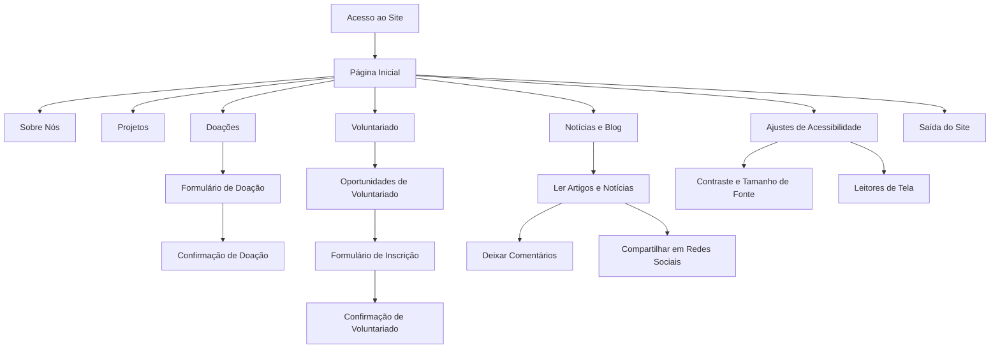
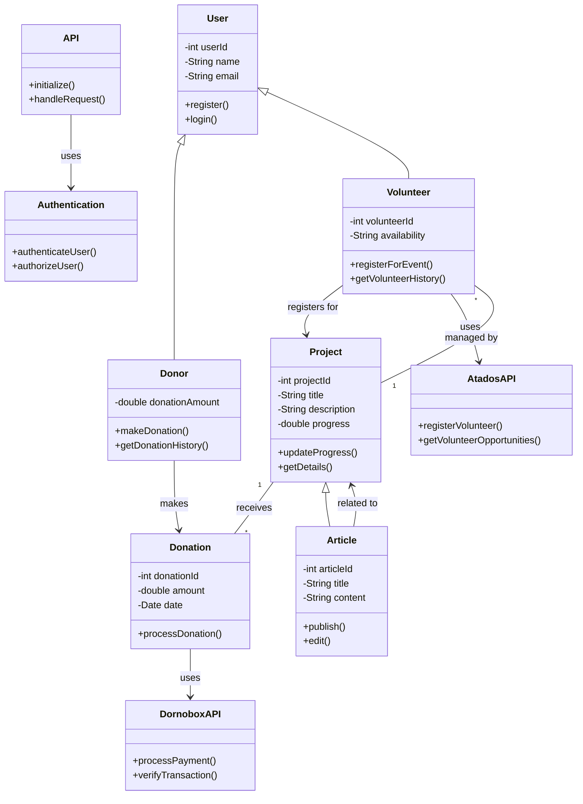

# API Gabriel Connect

## `GabrielConnectAPI`: Enfatiza a conexão entre a ONG e seus apoiadores.

#### Visão Geral
A **GabrielConnectAPI** é uma interface de programação de aplicações (API) desenvolvida para suportar o site oficial da ONG Gabriel. Esta API é fundamental para conectar a ONG com seus apoiadores, doadores e voluntários, permitindo uma interação fluida e segura entre todas as partes envolvidas. A GabrielConnectAPI facilita a gestão de doações, o engajamento de voluntários e a divulgação de informações sobre os projetos e impactos sociais da ONG.

#### Objetivos Principais
- **Facilitar Doações**: Integrar a plataforma Dornobox para permitir doações seguras e em tempo real. Exibir metas de arrecadação e campanhas ativas de maneira transparente.
- **Gerenciar Voluntariado**: Conectar com a plataforma Atados para facilitar o processo de inscrição e participação em atividades voluntárias.
- **Divulgar Informações**: Fornecer dados atualizados sobre projetos sociais, notícias e artigos relacionados à causa da ONG Gabriel.
- **Garantir Acessibilidade**: Assegurar que o site seja acessível a todos os usuários, incluindo aqueles com necessidades especiais.

#### Funcionalidades
1. **Integração com Dornobox**
   - Endpoint para processar doações.
   - Exibição de metas de arrecadação e progresso das campanhas.
   - Segurança nas transações financeiras.

2. **Gerenciamento de Voluntários**
   - Integração com a plataforma Atados.
   - Endpoints para inscrição e gerenciamento de voluntários.
   - Notificações e atualizações sobre eventos e atividades.

3. **Sistema de Gerenciamento de Conteúdo (CMS)**
   - Endpoints para criar, atualizar e deletar artigos, notícias e informações sobre projetos.
   - Ferramentas para moderar comentários e interações dos usuários.

4. **Acessibilidade e Inclusão**
   - Suporte para leitores de tela e navegação por teclado.
   - Ajustes de contraste e tamanho de fonte.
   - Descrições de imagens e outros recursos de acessibilidade.

5. **Monitoramento e Logs**
   - Implementação de sistemas de monitoramento para verificar a saúde da API.
   - Logs detalhados para análise e resolução de problemas.

#### Tecnologia e Segurança
- **Linguagens e Frameworks**: Desenvolvida utilizando programação reativa com Spring Webflux, Java e PostgreSQL para garantir robustez e escalabilidade.
- **Testes**: Testes unitários e de integração utilizando JUnit5 e Mockito para assegurar a qualidade do código.
- **Segurança**: Implementação de práticas de segurança de ponta, incluindo criptografia de dados e autenticação OAuth.
- **Escalabilidade**: Arquitetura projetada para escalar conforme o aumento do tráfego, especialmente durante campanhas de doação.
---
### Fluxo do Usuário no Site da ONG Gabriel

1. **Acesso ao Site**:
   - O usuário acessa o site da ONG Gabriel através do navegador.

2. **Página Inicial**:
   - O usuário é recebido com uma visão geral da missão da ONG, projetos em destaque, e chamadas para ação (doar, voluntariar-se, saber mais).

3. **Navegação**:
   - O usuário navega pelo menu principal para acessar diferentes seções: 
     - **Sobre Nós**: Informações sobre a missão, visão e valores da ONG.
     - **Projetos**: Detalhes sobre os projetos em andamento, metas e impacto.
     - **Notícias e Blog**: Artigos e notícias relacionadas às atividades da ONG.
     - **Voluntariado**: Informações sobre como se voluntariar e integração com a plataforma Atados.
     - **Doações**: Página dedicada para doações através da integração com Dornobox.

4. **Doações**:
   - O usuário clica na seção de doações.
   - Preenche o formulário de doação, seleciona o valor e método de pagamento.
   - Confirma a doação e recebe uma confirmação por email.

5. **Voluntariado**:
   - O usuário clica na seção de voluntariado.
   - Visualiza oportunidades de voluntariado integradas com a plataforma Atados.
   - Preenche o formulário de inscrição para voluntariado.
   - Recebe confirmação e detalhes por email.

6. **Interação com Conteúdo**:
   - O usuário pode ler artigos e notícias no blog.
   - Deixar comentários e compartilhar conteúdos em redes sociais.

7. **Acessibilidade**:
   - Usuários com necessidades especiais podem ajustar o contraste, tamanho da fonte e utilizar leitores de tela para navegar pelo site.

8. **Saída do Site**:
   - O usuário pode sair do site a qualquer momento, retornando à página inicial ou fechando o navegador.

### Diagrama em Mermaid

Este diagrama resume o fluxo do usuário no site da ONG Gabriel, desde o acesso inicial até a saída, destacando as principais interações e funcionalidades disponíveis no site.

#### Benefícios
- **Para a ONG**: Melhor gestão de recursos e maior transparência com os doadores e voluntários.
- **Para os Doadores**: Processo de doação simplificado e seguro, com atualizações em tempo real sobre o impacto de suas contribuições.
- **Para os Voluntários**: Facilidade de inscrição e participação em atividades, com acesso a informações relevantes e atualizações.

A GabrielConnectAPI é uma peça central no ecossistema digital da ONG Gabriel, criando uma ponte eficaz entre a organização e todos aqueles que se importam com sua missão e desejam contribuir para suas causas sociais.
---
### Diagrama de Classe para a Aplicação GabrielConnectAPI

Vou criar um diagrama de classes que represente a estrutura básica da aplicação GabrielConnectAPI, incluindo classes principais e suas relações.

#### Diagrama

### Descrição das Classes

1. **API**
   - **Métodos**: `initialize()`, `handleRequest()`
   - Responsável por inicializar e gerenciar as requisições da API.

2. **User**
   - **Atributos**: `userId`, `name`, `email`
   - **Métodos**: `register()`, `login()`
   - Representa um usuário genérico do sistema, podendo ser um doador ou voluntário.

3. **Donor (Doador)**
   - **Atributos**: `donationAmount`
   - **Métodos**: `makeDonation()`, `getDonationHistory()`
   - Extende a classe `User` e adiciona funcionalidades específicas para doadores.

4. **Volunteer (Voluntário)**
   - **Atributos**: `volunteerId`, `availability`
   - **Métodos**: `registerForEvent()`, `getVolunteerHistory()`
   - Extende a classe `User` e adiciona funcionalidades específicas para voluntários.

5. **Project (Projeto)**
   - **Atributos**: `projectId`, `title`, `description`, `progress`
   - **Métodos**: `updateProgress()`, `getDetails()`
   - Representa um projeto social da ONG.

6. **Article (Artigo)**
   - **Atributos**: `articleId`, `title`, `content`
   - **Métodos**: `publish()`, `edit()`
   - Representa artigos e notícias publicados no site.

7. **Donation (Doação)**
   - **Atributos**: `donationId`, `amount`, `date`
   - **Métodos**: `processDonation()`
   - Gerencia as transações de doações realizadas no site.

8. **Authentication (Autenticação)**
   - **Métodos**: `authenticateUser()`, `authorizeUser()`
   - Responsável por autenticar e autorizar usuários no sistema.

9. **DornoboxAPI**
   - **Métodos**: `processPayment()`, `verifyTransaction()`
   - Interface para integração com Dornobox para processar pagamentos.

10. **AtadosAPI**
    - **Métodos**: `registerVolunteer()`, `getVolunteerOpportunities()`
    - Interface para integração com Atados para gerenciar oportunidades de voluntariado.

Este diagrama de classes fornece uma visão geral das principais entidades e suas relações na aplicação GabrielConnectAPI.
