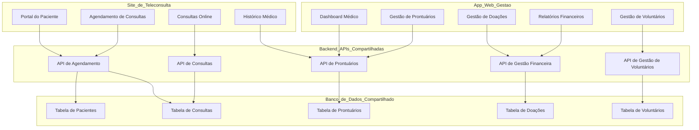

# 🚧 VitalNet 🚧

**VitalNet API** é uma solução robusta que fornece serviços de integração para teleconsultas e gestão, conectando a administração de pacientes, médicos, consultas e doações em uma única plataforma. Essa API RESTful foi projetada para ser escalável, segura e eficiente, permitindo que diferentes aplicações (como sites e apps móveis) acessem e manipulem dados de forma consistente e em tempo real.

#### **Principais Funcionalidades**:
- **Gerenciamento de Pacientes**: Cadastro, consulta e atualização de informações de pacientes.
- **Agendamento de Consultas**: Marcação e gerenciamento de consultas médicas online.
- **Prontuários Eletrônicos**: Armazenamento e recuperação de prontuários médicos, garantindo acesso seguro e centralizado.
- **Gestão de Doações**: Controle das doações realizadas para a ONG, facilitando o acompanhamento financeiro.
- **Controle de Voluntários**: Administração do cadastro e da disponibilidade de voluntários.
- **Autenticação Segura**: Controle de acessos com perfis de usuário (pacientes, médicos, administradores) para garantir a segurança dos dados.
- **Relatórios e Estatísticas**: Geração de relatórios sobre consultas realizadas, doações recebidas e atividades dos voluntários.

#### **Arquitetura**:
- **APIs RESTful**: Comunicação eficiente entre aplicações web e móveis.
- **Autenticação JWT**: Garantia de segurança com tokens de autenticação.
- **Banco de Dados Relacional**: Estrutura relacional que facilita consultas e garante integridade de dados.
- **Documentação Completa**: Disponível via Swagger ou outra ferramenta de documentação de APIs, garantindo fácil integração e uso.

#### **Benefícios**:
- **Centralização de Dados**: Informações acessíveis de qualquer plataforma, otimizando a gestão de consultas e atividades da ONG.
- **Integração Simples**: API única que permite a criação de diferentes interfaces, como sites de teleconsulta e aplicativos de gestão.
- **Escalabilidade**: Capacidade de crescer junto com a demanda da ONG.
- **Segurança**: Garantia de que todos os dados sensíveis serão tratados de acordo com normas como a LGPD.

---
Essa API tem como proposta se comunicar com aplicações distintas:

**Site**: Focado no público externo e pacientes, com funções informativas e de teleconsulta.
**App Web**: Focado na teleconsulta (para pacientes e profissionais de saúde) e na gestão interna (para administradores e gestores).

### 1. **Base de Dados Compartilhada:**
   - Tanto o site quanto o app web utilizariam a **mesma base de dados**. Isso garante que todas as informações (agendamentos, consultas, dados dos pacientes, dados administrativos) estejam sempre atualizadas em tempo real, independente da plataforma usada para acessar.
   - A base de dados será dividida em tabelas específicas para diferentes áreas:
     - **Tabelas de pacientes, médicos e prontuários**: Compartilhadas entre o site e o app.
     - **Tabelas de gestão**: Acessadas apenas pelo app web.
     - **Segurança**: Assegurar que dados de pacientes (LGPD) sejam devidamente protegidos, com diferentes níveis de acesso dependendo do tipo de usuário (médico, administrador, paciente).

### 2. **APIs RESTful Compartilhadas:**
   - **Backend**: O backend será compartilhado para servir tanto o site quanto o app, fornecendo APIs REST para integração. Essas APIs gerenciarão todas as operações de dados, como criação, leitura, atualização e exclusão (CRUD), garantindo que ambos os projetos acessem a mesma lógica de negócios.
   - **Autenticação e Autorização**:
     - Será utilizado um sistema de **autenticação centralizada**, como OAuth2 ou JWT, onde os usuários se autenticam uma vez e suas permissões são verificadas para determinar o que podem acessar (por exemplo, médicos e administradores têm acesso ao app, pacientes usam o site).
   - **APIs específicas**:
     - **Para o site**: APIs que permitam o agendamento de consultas, visualização de prontuários e acesso a histórico médico.
     - **Para o app**: APIs adicionais para gerenciar doações, relatórios financeiros, e gestão de voluntários.

### 3. **Sincronização de Dados em Tempo Real:**
   - Para garantir que ambos os sistemas estejam sempre atualizados, será implementada uma solução de **sincronização de dados em tempo real** usando tecnologias como **WebSockets** ou **APIs com polling**.
   - **Exemplo de uso**:
     - Um paciente agenda uma consulta pelo site, e o administrador ou médico consegue ver essa nova consulta imediatamente no dashboard do app web.
     - O médico insere notas durante a consulta no app web, e o paciente pode acessar o histórico atualizado imediatamente no site.

### 4. **Notificações e Mensageria:**
   - Um sistema de **notificações push** pode ser integrado, tanto para o site quanto para o app, usando APIs como Firebase Cloud Messaging (FCM).
   - **Notificações no site**:
     - Enviar lembretes de consultas, novos resultados médicos ou mensagens dos médicos.
   - **Notificações no app**:
     - Alertas sobre doações, relatórios financeiros e atividades de voluntários.

### 5. **Sistema de Log e Auditoria:**
   - Ambos os sistemas (site e app) precisam ter logs centralizados de todas as atividades, como criação de consultas, doações recebidas, ou alterações nos prontuários.
   - Um **sistema de auditoria** pode ser implementado para rastrear ações administrativas e médicas, garantindo a conformidade com normas de segurança e privacidade de dados (como LGPD).

### 6. **Segurança e Permissões de Acesso:**
   - Utilização de um **sistema de controle de acesso baseado em funções (RBAC)**, que permitirá definir diferentes níveis de acesso:
     - **Pacientes**: Acesso ao site para agendar consultas, visualizar histórico, e realizar consultas online.
     - **Médicos**: Acesso ao app para gerenciar prontuários, consultar pacientes, e visualizar agendas.
     - **Administradores da ONG**: Acesso ao app para gerenciar doações, voluntários e finanças.
   - **Criptografia**: Todo o tráfego de dados entre o site, app e APIs será protegido com SSL/TLS para garantir a segurança na transmissão de informações sensíveis.

### 7. **Exemplo de Fluxo de Integração:**
   - **Paciente agenda consulta no site**:
     1. O paciente faz login no site e agenda uma consulta.
     2. O site envia uma requisição para a API REST, que atualiza a base de dados compartilhada.
     3. O agendamento aparece instantaneamente no dashboard de médicos no app web.
     4. O médico recebe uma notificação e pode preparar a consulta.
   
   - **Médico atualiza prontuário no app web**:
     1. Durante a consulta, o médico acessa o prontuário do paciente via app web.
     2. Após a consulta, o médico atualiza as informações do prontuário.
     3. A API REST sincroniza o prontuário, e o paciente pode ver as informações atualizadas no site.

### 8. **Benefícios dessa Integração:**
   - **Experiência fluida**: Embora sejam dois projetos separados, a integração via API e base de dados compartilhada cria uma experiência fluida e unificada para os usuários.
   - **Manutenção simplificada**: O backend compartilhado permite uma manutenção mais simples, pois não há necessidade de duplicar a lógica de negócios.
   - **Escalabilidade**: A infraestrutura permite a adição de novas funcionalidades tanto no site quanto no app de forma independente, conforme as necessidades da ONG.

Essa abordagem permite que o site e o app sejam mantidos como projetos separados, conforme solicitado, mas com uma integração sólida que garante a consistência e sincronização dos dados. Isso atende à necessidade de gestão centralizada no app e ao uso do site para teleconsultas e comunicação com o público externo.

Aqui está um modelo gráfico utilizando o Mermaid para representar como as APIs compartilhadas entre o **site de teleconsulta** e o **app de gestão** podem funcionar:

Este gráfico ilustra a interação entre o **site**, o **app de gestão**, as **APIs compartilhadas** e o **banco de dados**, demonstrando como ambos os sistemas podem acessar os mesmos dados e manter a consistência e sincronização entre si.

Abaixo estão os detalhes das principais tabelas para um banco de dados relacional que suporta o modelo discutido anteriormente. Esse modelo visa atender às necessidades de um **site de teleconsulta** e um **app web de gestão**, com compartilhamento de dados entre ambos.

### Tabelas do Banco de Dados

#### **1. Tabela `Pacientes`**
Armazena informações de cada paciente registrado no sistema.

| Coluna          | Tipo          | Descrição                      |
|-----------------|---------------|---------------------------------|
| `id`            | INT           | Chave primária, identificador único |
| `nome`          | VARCHAR(100)  | Nome completo do paciente       |
| `data_nascimento`| DATE          | Data de nascimento              |
| `telefone`      | VARCHAR(15)   | Contato do paciente             |
| `email`         | VARCHAR(100)  | E-mail do paciente              |
| `endereco`      | VARCHAR(255)  | Endereço residencial            |

#### **2. Tabela `Medicos`**
Armazena dados dos médicos que realizarão as consultas.

| Coluna          | Tipo          | Descrição                      |
|-----------------|---------------|---------------------------------|
| `id`            | INT           | Chave primária, identificador único |
| `nome`          | VARCHAR(100)  | Nome completo do médico         |
| `crm`           | VARCHAR(50)   | Número de registro profissional |
| `especialidade` | VARCHAR(100)  | Especialidade médica            |
| `telefone`      | VARCHAR(15)   | Contato do médico               |
| `email`         | VARCHAR(100)  | E-mail do médico                |

#### **3. Tabela `Consultas`**
Armazena os dados das consultas agendadas, relacionando paciente e médico.

| Coluna          | Tipo          | Descrição                      |
|-----------------|---------------|---------------------------------|
| `id`            | INT           | Chave primária, identificador único |
| `data_hora`     | DATETIME      | Data e hora da consulta         |
| `id_paciente`   | INT           | Chave estrangeira, refere-se ao paciente |
| `id_medico`     | INT           | Chave estrangeira, refere-se ao médico |
| `status`        | ENUM('agendada', 'concluída', 'cancelada') | Status da consulta |

**Relações**:
- `id_paciente` -> `Pacientes.id`
- `id_medico` -> `Medicos.id`

#### **4. Tabela `Prontuarios`**
Armazena informações detalhadas sobre as consultas e diagnósticos realizados.

| Coluna          | Tipo          | Descrição                      |
|-----------------|---------------|---------------------------------|
| `id`            | INT           | Chave primária, identificador único |
| `id_consulta`   | INT           | Chave estrangeira, refere-se à consulta |
| `notas`         | TEXT          | Notas do médico sobre a consulta |
| `prescricao`    | TEXT          | Medicamentos ou tratamentos prescritos |

**Relação**:
- `id_consulta` -> `Consultas.id`

#### **5. Tabela `Doacoes`**
Armazena informações sobre as doações feitas à ONG.

| Coluna          | Tipo          | Descrição                      |
|-----------------|---------------|---------------------------------|
| `id`            | INT           | Chave primária, identificador único |
| `id_doador`     | INT           | Chave estrangeira, refere-se ao doador |
| `valor`         | DECIMAL(10, 2)| Valor da doação                 |
| `data`          | DATE          | Data da doação                  |

#### **6. Tabela `Voluntarios`**
Armazena informações dos voluntários que atuam na ONG.

| Coluna          | Tipo          | Descrição                      |
|-----------------|---------------|---------------------------------|
| `id`            | INT           | Chave primária, identificador único |
| `nome`          | VARCHAR(100)  | Nome completo do voluntário     |
| `funcao`        | VARCHAR(100)  | Função ou atividade desempenhada |
| `disponibilidade`| VARCHAR(50)   | Disponibilidade de dias/horas   |

#### **7. Tabela `Doadores`**
Armazena informações dos doadores da ONG.

| Coluna          | Tipo          | Descrição                      |
|-----------------|---------------|---------------------------------|
| `id`            | INT           | Chave primária, identificador único |
| `nome`          | VARCHAR(100)  | Nome completo do doador         |
| `email`         | VARCHAR(100)  | E-mail do doador                |
| `telefone`      | VARCHAR(15)   | Contato do doador               |

#### **8. Tabela `Usuarios`**
Armazena dados dos usuários que têm acesso ao sistema (pacientes, médicos, administradores).

| Coluna          | Tipo          | Descrição                      |
|-----------------|---------------|---------------------------------|
| `id`            | INT           | Chave primária, identificador único |
| `nome`          | VARCHAR(100)  | Nome completo                  |
| `email`         | VARCHAR(100)  | E-mail para login              |
| `senha`         | VARCHAR(255)  | Senha criptografada            |
| `perfil`        | ENUM('paciente', 'medico', 'admin') | Perfil de acesso |

### Relacionamentos no Modelo Relacional

1. **Pacientes e Consultas**: Um paciente pode ter várias consultas, e cada consulta está vinculada a um paciente. (`Pacientes.id` → `Consultas.id_paciente`).
2. **Médicos e Consultas**: Um médico pode realizar várias consultas, e cada consulta está vinculada a um médico. (`Medicos.id` → `Consultas.id_medico`).
3. **Consultas e Prontuários**: Cada consulta pode ter um prontuário associado. (`Consultas.id` → `Prontuarios.id_consulta`).
4. **Doações e Doadores**: Cada doação está associada a um doador. (`Doadores.id` → `Doacoes.id_doador`).
5. **Voluntários**: Armazenam informações específicas dos colaboradores que atuam na ONG.

### Benefícios do Modelo Relacional

- **Integridade referencial**: Ao utilizar chaves estrangeiras, garantimos que, por exemplo, uma consulta esteja sempre associada a um paciente e a um médico válido.
- **Normalização**: Os dados estão organizados em entidades bem definidas, evitando redundância de informações.
- **Flexibilidade**: O modelo permite consultas complexas e relacionamentos robustos, essenciais para um sistema de teleconsulta e gestão.

Essa estrutura atenderia tanto o site de teleconsulta quanto o app de gestão da ONG, com dados sincronizados e acessíveis pelas APIs compartilhadas.

